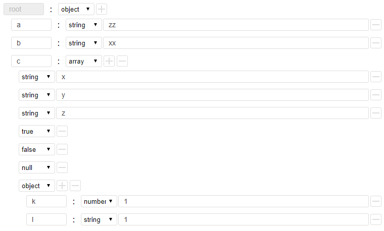

<p align="center">
   <a href="https://www.npmjs.com/package/h5-json-edit">
   		
   </a>
   <a href="https://www.npmjs.com/package/h5-json-edit">
   		
   </a>
</p>

## h5-json-edit

提供页面编辑 json 字符串的能力

## 运行 demo

-   npm install
-   npm install gulp -g (安装过可以忽略)
-   gulp
-   浏览器中输入http://127.0.0.1:3102 (PC)
-   浏览器中输入http://ip:3102 (手机浏览器)

## 获取 vue-unicom

-   npm i h5-json-edit
-   github 下载 zip 包，dist/lib/json-edit.js，可以直接引入 到页面

## 实例

```html
<!-- 按钮输出 -->
<span class="btn" id="output">输出</span>
<!-- 需要设置好固定的宽和高 -->
<div id="app" class="app"></div>
```

```javascript
// 第一个参数是id 或者 dom
let jsonEdit = new JsonEdit("app");

// 初始化数据
jsonEdit.renderByData({ a: "zz", b: "xx", c: ["x", "y", "z", true, false, null, { k: 1, l: "1" }] });

// 点击按钮，输出编辑的json字符串
document.getElementById("output").onclick = function() {
    let out = jsonEdit.getData();
    console.log("out for edit >>>.", out);
};
```

## 截图
